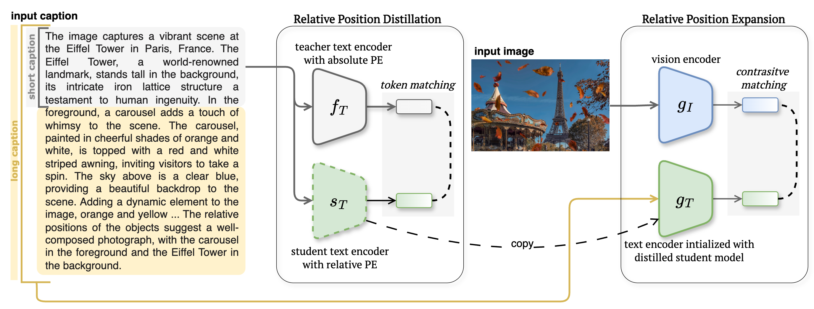

# 🌷 TULIP: Token-length Upgraded CLIP 
## [[Paper](https://arxiv.org/pdf/2410.10034)] [[Website (TBD)]()] [[Checkpoints (TBD)]()]

## Overview 🌟  
**TULIP** (Token-length Upgraded CLIP) is a method to upgrade the caption length of CLIP-like models to perform long caption understanding. This repository contains the code associated with the paper:  
> *"TULIP: Token-length Upgraded CLIP"*  
> *[Ivona Najdenkoska](https://ivonajdenkoska.github.io/)٭, [Mohammad M. Derakshani](https://mmderakhshani.github.io/)٭, [Yuki M. Asano](https://yukimasano.github.io/), [Nanne van Noord](https://nanne.github.io/), [Marcel Worring](https://staff.fnwi.uva.nl/m.worring/), [Cees Snoek](https://www.ceessnoek.info/)*
 

## Highlights 🚀  
- **Architectural Enhancement**: TULIP injects relative positional encodings into contrastive vision-language models to handle long image captions.
- **Seamless Integration**: A plug-and-play approach that works with CLIP-like models.
- **Improved Performance**: Achieves state-of-the-art results, surpassing baselines like CLIP and LongCLIP on long-caption understanding tasks.


## Usage 🛠️
1. To begin, clone this repository and navigate to the tulip folder:
```bash
git clone https://github.com/ivonajdenkoska/tulip.git
cd tulip
```

2. Our repo is based on [open_clip](https://github.com/mlfoundations/open_clip), so please install the following packages:
```bash
conda create -n openclip python=3.10 -y
conda activate openclip
```

3. For training TULIP and further development, please install additional packages:
```bash
cd open_clip
make install
make install training
```

## Data 🗂️

We use [ShareGPT4V](https://sharegpt4v.github.io/) dataset for TULIP's training. You can download the data annotations from [here](https://huggingface.co/datasets/Lin-Chen/ShareGPT4V/tree/main) (use share-captioner_coco_lcs_sam_1246k_1107.json), and the images from the links below. For more information on how to organize the folders, check [here](https://github.com/beichenzbc/Long-CLIP/blob/main/train/train.md#2-prepare-sharegpt4v-dataset).
- LAION-CC-SBU-558K: [images.zip](https://huggingface.co/datasets/liuhaotian/LLaVA-Pretrain/blob/main/images.zip)
- COCO: [train2017](http://images.cocodataset.org/zips/train2017.zip)
- WebData: [images](https://drive.google.com/drive/folders/1tCUQ-sq6vdshZVkF0ZeF3K4eztkXJgax?usp=sharing) (academic usage)
- SAM: [images](https://ai.meta.com/datasets/segment-anything-downloads/)
- GQA: [images](https://downloads.cs.stanford.edu/nlp/data/gqa/images.zip)
- OCR-VQA: [download script](https://drive.google.com/drive/folders/1_GYPY5UkUy7HIcR0zq3ZCFgeZN7BAfm_?usp=sharing)
- TextVQA: [trainvalimages](https://dl.fbaipublicfiles.com/textvqa/images/train_val_images.zip)
- VisualGenome: [part1](https://cs.stanford.edu/people/rak248/VG_100K_2/images.zip), [part2](https://cs.stanford.edu/people/rak248/VG_100K_2/images2.zip)

To further prepare the dataset for the training stage, please convert the json into a csv file, by running ```get_csv(args)``` in ```open_clip.data_prep.sharegpt_preprocessing.py```. Afterwards, create two separate csv files: *_train.csv and *_val.csv. For the validation split use the first 1k instances of ```share-captioner_coco_lcs_sam_1246k_1107```, and use the remaining for training.

## Training 🏋️‍♂️


The training process of TULIP consists of two stages: **relative position distillation** and **relative position expansion**. 
The first stage consists of distilling the knowledge of an exisitng CLIP model with fixed positional encodings, into a student model with relative positional encodings (i.e. RoPE, CoPE, etc.). To perfom this, you can use the following bash script to run the training on a single GPU. Additionally make sure to set the correct paths to the dataset location ```--train-data``` and ```--val-data``` and logs ```--logs```.

```bash
python -m training.main_distill_rope \
    --dataset-type "csv" \
    --batch-size 20 \
    --train-data "/ShareGPT4V/data/share-captioner_coco_lcs_sam_1246k_1107_train.csv" \
    --val-data "/ShareGPT4V/data/share-captioner_coco_lcs_sam_1246k_1107_val.csv" \
    --logs "/logs/sharegpt4v/" \
    --warmup 1000 \
    --lr 5e-4 \
    --wd 0.1 \
    --epochs 30 \
    --workers 8 \
    --save-frequency 5 \
    --model "ViT-L-14" \
    --pretrained "openai" \
    --precision 'amp_bf16' \
    --log-every-n-steps 100 \
    --accum-freq 4 \
    --context-length 77 \
    --student-context-length 248 \
    --wandb-project-name "dense-cap-distill" \
    --loss-type "cosine" \
    --report-to "wandb" \
  ```

For training on multiple GPUs (e.g launhing the job on a node of 8 GPUs), you can use ```torchrun``` and ```--nproc_per_node``` flag. So simply replace the first line with the follwing: ```TORCH_CUDNN_V8_API_ENABLED=1 torchrun --nproc_per_node 8 -m training.main_distill_rope \ ```.

For the second stage of the training, we perfrom fine-tuning of the student model by optimizing the CLIP loss with the new positional encodings for a single epoch. Please make sure to set the correct path for the distilled model as ```--student-model```.
```bash
python -m training.main_context_finetune_rope \
    --dataset-type "csv" \
    --batch-size 4 \
    --train-data "/ShareGPT4V/data/share-captioner_coco_lcs_sam_1246k_1107_train.csv" \
    --val-data "/ShareGPT4V/data/share-captioner_coco_lcs_sam_1246k_1107_val.csv" \
    --logs "/logs/sharegpt4v/" \
    --warmup 1000 \
    --lr 1e-5 \
    --wd 0.1 \
    --epochs 30 \
    --workers 8 \
    --save-frequency 5 \
    --model "ViT-L-14" \
    --pretrained "openai" \
    --precision 'amp_bf16' \
    --log-every-n-steps 100 \
    --accum-freq 4 \
    --context-length 77 \
    --student-context-length 248 \
    --loss-type "clip_loss" \
    --student-model "/logs/sharegpt4v/checkpoints/epoch_5.pt" \
    --wandb-project-name "dense-cap-ctx-extension" \
    --report-to "wandb" \

```
Similalry as before, to training on multiple GPUs (e.g launhing the job on a node of 8 GPUs), replace the first line with the follwing: ```TORCH_CUDNN_V8_API_ENABLED=1 torchrun --nproc_per_node 8 -m training.main_context_finetune_rope \ ```.

## Evaluation 📊
To evaluate TULIP on cross-modal retrieval tasks, you can simply use the ```eval_tulip.py``` script. Flags such as ```--run_sharegpt4v``` will determine which benchmarks will be used.

```bash
python eval_tulip.py 
    --model_name ViT-L-14 
    --pretrained /path_to_best_checkpoint/epoch_1.pt 
    --run_sharegpt4v --run_urban1k --run_dci_long --run_coco --run_flickr 
    --wandb
```
## Cross-modal retreival examples 🔍
### Image-to-Text retreival (comparison to CLIP)


### Text-to-Image retreival (comparison to CLIP)


## Image generation examples 🔍 
We compare our TULIP-based model to several image generation baselines using Stable Diffusion XL with different text enocders: CLIP, [Long-CLIP](https://github.com/beichenzbc/Long-CLIP), and two T5-based ones, [PIXART-Alpha](https://pixart-alpha.github.io/) and [ELLA](https://ella-diffusion.github.io/). 


### More image generation comparison (to T5-based models)  

<div style="display: flex; justify-content: space-around;">
  
  
</div>

## Citation 📜
If you find the TULIP paper and code useful for your research and applications, please cite using this BibTeX:
```
@article{najdenkoska2024tulip,
  title={TULIP: Token-length Upgraded CLIP},
  author={Najdenkoska, Ivona and Derakhshani, Mohammad Mahdi and 
  Asano, Yuki M and van Noord, Nanne and Worring, Marcel and Snoek, 
  Cees GM},
  journal={arXiv preprint arXiv:2410.10034},
  year={2024}
}
```

## Acknowledgements 🌸
This project is based on [open_clip](https://github.com/mlfoundations/open_clip) - special thanks to all the contributors. We also thank [Long-CLIP](https://github.com/beichenzbc/Long-CLIP) for providing the pretrained models and code, and [ShareGPT4V](https://sharegpt4v.github.io/) for providing the data.